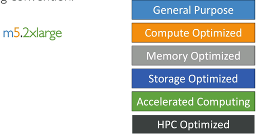

# Amazon EC2
* EC2 is one of the most popular of AWS’ offering
* EC2 = Elastic Compute Cloud = Infrastructure as a Service
* It mainly consists in the capability of :
  * Renting virtual machines (EC2)
  * Storing data on virtual drives (EBS)
  * Distributing load across machines (ELB)
  * Scaling the services using an auto-scaling group (ASG)
* Knowing EC2 is fundamental to understand how the Cloud works

## EC2 sizing & configuration options
* Operating System (OS): Linux, Windows or Mac OS
* How much compute power & cores (CPU)
* How much random-access memory (RAM)
* How much storage space:
  * Network-attached (EBS & EFS)
  * hardware (EC2 Instance Store)
* Network card: speed of the card, Public IP address
* Firewall rules: security group
* Bootstrap script (configure at first launch): EC2 User Data

## EC2 User Data
* It is possible to bootstrap our instances using an EC2 User data script.
* `bootstrapping` means launching commands when a machine starts
* That script is `only run once` at the instance first start
* EC2 user data is used to automate boot tasks such as:
  * Installing updates
  * Installing software
  * Downloading common files from the internet
  * Anything you can think of
* The EC2 User Data Script runs with the `root user`

## EC2 Instance Types - Overview
* You can use different types of EC2 instances that are optimised for different use cases (https://aws.amazon.com/ec2/instance-types/)
  * General Purpose
  * Compute Optimized
  * Memory Optimized
  * Storage Optimized
  * Accelerated Computing
  * HPC Optimized.
* AWS has the following naming convention:
  

where:
  * m: instance class
  * 5: generation (AWS improves them over time)
  * 2xlarge: size within the instance class

---

## EC2 Instance Categories

| Category | Primary Series / Families | Best Suited For |
| --- | --- | --- |
| General Purpose | T2, T3, T3a, T4g, M5, M6i, M6g, M7g, M8g, M8i | Balanced compute, memory, and networking; web servers, microservices, and code repositories. |
| Compute Optimized | C1, C3, C4, C6i, C6gn, C7g, C8g, C8i | High-performance processors; batch processing, media transcoding, gaming, and machine learning inference. |
| Memory Optimized | R3, R4, R7g, R8g, X1, X2idn, X2iedn | Fast performance for large in-memory data sets, in-memory databases, and big data analytics. |
| Storage Optimized | D2, H1, I2, I3, I4i | High, sequential or random I/O access to very large local data sets, NoSQL, and data warehouses. |
| Accelerated Computing | P3, G5, G7, G7e | Hardware accelerators and GPUs; AI training, deep learning, graphics, and simulations. |
| HPC Optimized | High-performance computing families | Complex simulations and scale-out scientific workloads. |

### Type: General Purpose
* Great for a diversity of workloads such as web servers or code repositories
* Balance between:
  * Compute
  * Memory
  * Networking

### Type: Compute Optimized
* Great for compute-intensive tasks that require high performance processors:
  * Batch processing workloads
  * Media transcoding
  * High performance web servers
  * High performance computing (HPC)
  * Scientific modeling & machine learning
  * Dedicated gaming servers

### Type: Memory Optimized
* Fast performance for workloads that process large data sets in memory
* Use cases:
  * High performance, relational/non-relational databases
  * Distributed web scale cache stores
  * In-memory databases optimized for BI (business intelligence)
  * Applications performing real-time processing of big unstructured data

### Type: Storage Optimized
* Great for storage-intensive tasks that require high, sequential read and write access to large data sets on local storage
* Use cases:
  * High frequency online transaction processing (OLTP) systems
  * Relational & NoSQL databases
  * Cache for in-memory databases (for example, Redis)
  * Data warehousing applications
  * Distributed file systems

---

##  Security Groups - Introduction
* Security Groups are the fundamental of network security in AWS
* They control how traffic is allowed into or out of our EC2 Instances.
* Security groups only contain `allow` rules
* Security groups rules can reference by IP or by security group

### Security Groups Deeper Dive
* Security groups are acting as a “firewall” on EC2 instances
* They regulate:
  * Access to Ports
  * Authorised IP ranges – IPv4 and IPv6
  * Control of inbound network (from other to the instance)
  * Control of outbound network (from the instance to other)

### Security Groups - Good to know
* Can be attached to multiple instances
* Locked down to a region / VPC combination
* Does live `outside` the EC2 – if traffic is blocked the EC2 instance won’t see it
* It’s good to maintain one separate security group for SSH access
* If your application is not accessible (time out), then it’s a security group issue
* If your application gives a “connection refused“ error, then it’s an application error or it’s not launched
* All inbound traffic is `blocked` by default
* All outbound traffic is `authorised` by default

### Classic Ports to know
* 22 = SSH (Secure Shell) - log into a Linux instance
* 21 = FTP (File Transfer Protocol) – upload files into a file share
* 22 = SFTP (Secure File Transfer Protocol) – upload files using SSH
* 80 = HTTP – access unsecured websites
* 443 = HTTPS – access secured websites
* 3389 = RDP (Remote Desktop Protocol) – log into a Windows instance

---

## EC2 Instances Purchasing Options
*` On-Demand` Instances – short workload, predictable pricing, pay by second
* `Reserved` (1 & 3 years)
  * `Reserved Instances` – long workloads
  *` Convertible Reserved Instances` – long workloads with flexible instances
* `Savings Plans` (1 & 3 years) –commitment to an amount of usage, long workload
* `Spot Instances` – short workloads, cheap, can lose instances (less reliable)
* `Dedicated Hosts` – book an entire physical server, control instance placement
* `Dedicated Instances` – no other customers will share your hardware
* `Capacity Reservations` – reserve capacity in a specific AZ for any duration

### EC2 On Demand
* Pay for what you use:
  * Linux or Windows - billing per second, after the first minute
  * All other operating systems - billing per hour
* Has the highest cost but no upfront payment
* No long-term commitment
* `Recommended for short-term and un-interrupted workloads`, where you can't predict how the application will behave

### EC2 Reserved Instances
* Up to 72% discount compared to On-demand
* You reserve a specific instance attributes (Instance Type, Region, Tenancy, OS)
* Reservation Period – 1 year (+discount) or 3 years (+++discount)
* Payment Options – No Upfront (+), Partial Upfront (++), All Upfront (+++)
* Reserved Instance’s Scope – Regional or Zonal (reserve capacity in an AZ)
* `Recommended for steady-state usage applications (think database)`
* You can buy and sell in the Reserved Instance Marketplace
* Convertible Reserved Instance
  * Can change the EC2 instance type, instance family, OS, scope and tenancy
  * Up to 66% discount

### EC2 Savings Plans
* Get a discount based on long-term usage (up to 72% - same as RIs)
* Commit to a certain type of usage ($10/hour for 1 or 3 years)
* Usage beyond EC2 Savings Plans is billed at the On-Demand price
* `Locked to a specific instance family & AWS region` (e.g., M5 in us-east-1)
* Flexible across:
  * Instance Size (e.g., m5.xlarge, m5.2xlarge)
  * OS (e.g., Linux, Windows)
  * Tenancy (Host, Dedicated, Default)

### EC2 Spot Instances
* Can get a discount of up to 90% compared to On-demand
* Instances that you can `lose` at any point of time if your max price is less than the current spot price
* The `MOST cost-efficient` instances in AWS
* `Useful for workloads that are resilient to failure`
  * Batch jobs
  * Data analysis
  * Image processing
  * Any distributed workloads
  * Workloads with a flexible start and end time
*` Not suitable for critical jobs or databases`

### EC2 Dedicated Hosts
* A physical server with EC2 instance capacity fully dedicated to your use
* Allows you `address compliance requirements` and use your `existing serverbound software licenses` (per-socket, per-core, pe—VM software licenses)
* Purchasing Options:
  * `On-demand` – pay per second for active Dedicated Host
  * `Reserved` - 1 or 3 years (No Upfront, Partial Upfront, All Upfront)
* `The most expensive option`
* Useful for software that have complicated licensing model (BYOL – Bring Your Own License)
* Or for companies that have strong regulatory or compliance needs

### EC2 Dedicated Instances
* Instances run on hardware that’s dedicated to you
* May share hardware with other instances in same account
* No control over instance placement (can move hardware after Stop / Start)

#### Difference between EC2 Dedicated Instances vs Dedicated Hosts
* Amazon EC2 Dedicated Instances provide physical hardware isolation at the individual instance level, meaning you share hardware only with your own account while AWS manages placement, making them ideal for standard compliance and isolation. 
* In contrast, Dedicated Hosts reserve an entire physical server exclusively for your use, offering complete visibility into the hardware and precise placement control, which makes them the preferred choice for Bring-Your-Own-License (BYOL) software models and host-level billing.

### EC2 Capacity Reservations
* Reserve `On-Demand` instances capacity in a specific AZ for any duration
* You always have access to EC2 capacity when you need it
* `No time commitment` (create/cancel anytime), `no billing discounts`
* Combine with Regional Reserved Instances and Savings Plans to benefit from billing discounts
* You’re charged at On-Demand rate whether you run instances or not
* `Suitable for short-term, uninterrupted workloads that needs to be in a specific AZ`

### Which purchasing option is right for me?
* `On demand`: coming and staying in resort whenever we like, we pay the full price
* `Reserved`: like planning ahead and if we plan to stay for a long time, we may get a good discount.
* `Savings Plans`: pay a certain amount per hour for certain period and stay in any room type (e.g., King, Suite, Sea View, …)
* `Spot instances`: the hotel allows people to bid for the empty rooms and the highest bidder keeps the rooms. You can get kicked out at any time
* `Dedicated Hosts`: We book an entire building of the resort
* `Capacity Reservations`: you book a room for a period with full price even you don’t stay in it