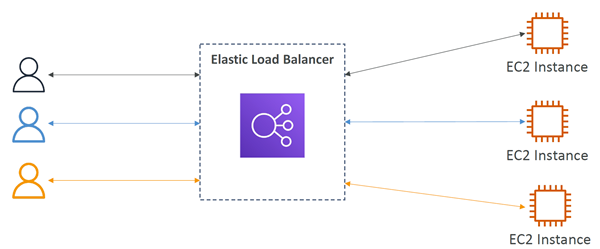
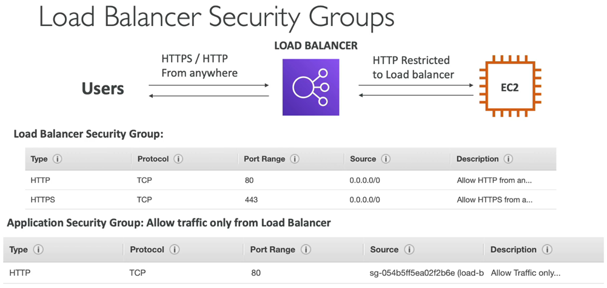
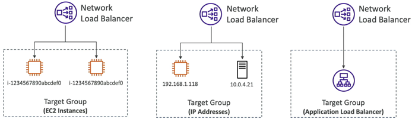
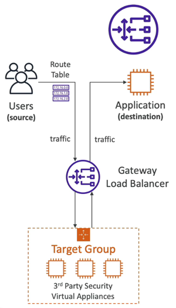
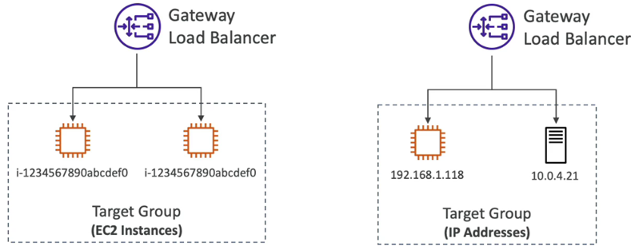
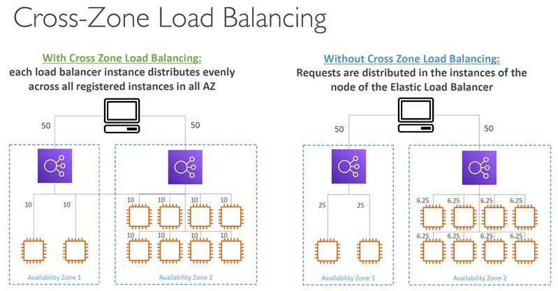

# Scalability & High Availability
* Scalability means that an application / system can handle greater loads by adapting.
* There are two kinds of scalability:
  * Vertical Scalability
  * Horizontal Scalability (= elasticity)
* Scalability is linked but different to High Availability
* Let’s deep dive into the distinction, using a call center as an example

## Vertical Scalability
* Vertically scalability means `increasing the size` of the instance
  * For example, your application runs on a t2.micro
  * Scaling that application vertically means running it on a t2.large
* Vertical scalability is very `common for non distributed systems, such as a database`.
* `RDS, ElastiCache are services that can scale vertically.`
* There’s usually a limit to how much you can vertically scale (hardware limit)

## Horizontal Scalability
* Horizontal Scalability means `increasing the number` of instances / systems for your application
* Horizontal scaling implies distributed systems.
* This is very `common for web applications / modern applications`
* It’s easy to horizontally scale thanks to the cloud offerings such as Amazon EC2

## High Availability
* High Availability usually goes hand in hand with horizontal scaling
* High availability means running your application / system in at least 2 data centers (== Availability Zones)
* The goal of high `availability is to survive a data center loss`
* The high availability can be passive (for RDS Multi AZ for example)
* The high availability can be active (for horizontal scaling)

## High Availability & Scalability For EC2
* Vertical Scaling: Increase instance size (= scale up / down)
  * From: t2.nano - 0.5G of RAM, 1 vCPU
  * To: u-12tb1.metal – 12.3 TB of RAM, 448 vCPUs
* Horizontal Scaling: Increase number of instances (= scale out (+) / in (-))
  * Auto Scaling Group
  * Load Balancer
* High Availability: Run instances for the same application across multi AZ
  * Auto Scaling Group multi AZ
  * Load Balancer multi AZ

---

# Load Balancing

## what is load balancing?
* Load Balances are servers that forward traffic to multiple servers (e.g., EC2 instances) downstream

## Why use a load balancer?
* Spread load across multiple downstream instances
* Expose a single point of access (DNS) to your application
* Seamlessly handle failures of downstream instances
* Do regular health checks to your instances
* Provide SSL termination (HTTPS) for your websites
* Enforce stickiness with cookies
* High availability across zones
* Separate public traffic from private traffic

## Why Elastic Load Balancer?
* An Elastic Load Balancer is a managed load balancer
  * AWS guarantees that it will be working
  * AWS takes care of upgrades, maintenance, high availability
  * AWS provides only a few configuration knobs
* It costs less to setup your own load balancer but it will be a lot more effort on your end
* It is integrated with many AWS offerings / services
  * EC2, EC2 Auto Scaling Groups, Amazon ECS
  * AWS Certificate Manager (ACM), CloudWatch
  * Route 53, AWS WAF, AWS Global Accelerator

## Health Checks
* Health Checks are crucial for Load Balancers
* They enable the load balancer to know if instances it forwards traffic to are available to reply to requests
* The health check is done on a port and a route (/health is common)
* If the response is not 200 (OK), then the instance is unhealthy

## Types of load balancer on AWS
* AWS has 4 kinds of managed Load Balancers:
  * `Classic` Load Balancer (v1 - old generation) – 2009 – CLB
    * HTTP, HTTPS, TCP, SSL (secure TCP)
  * `Application` Load Balancer (v2 - new generation) – 2016 – ALB
    * HTTP, HTTPS, WebSocket
  * `Network` Load Balancer (v2 - new generation) – 2017 – NLB
    * TCP, TLS (secure TCP), UDP
  * `Gateway` Load Balancer – 2020 – GWLB
    * Operates at layer 3 (Network layer) – IP Protocol
  
* Overall, it is recommended to use the newer generation load balancers as they provide more features
* Some load balancers can be setup as internal (private) or external (public) ELBs

### Application Load Balancer (v2)
* Application load balancers is Layer 7 (HTTP)
* Load balancing to multiple HTTP applications across machines (target groups)
* Load balancing to multiple applications on the same machine (ex: containers)
* Support for HTTP/2 and WebSocket
* Support redirects (from HTTP to HTTPS for example)

* Routing tables to different target groups:
  * Routing based on `path in URL` (example.com/users & example.com/posts)
  * Routing based on `hostname in URL` (one.example.com & other.example.com)
  * Routing based on `Query String, Headers` (example.com/users?id=123&order=false)
* ALB are a great fit for micro services & container-based application (example: Docker & Amazon ECS)
* Has a port mapping feature to redirect to a dynamic port in ECS
* In comparison, we’d need multiple Classic Load Balancer per application

#### ALB Target Groups 
* EC2 instances (can be managed by an Auto Scaling Group) – HTTP
* ECS tasks (managed by ECS itself) – HTTP
* Lambda functions – HTTP request is translated into a JSON event
* IP Addresses – must be private IPs
* ALB can route to multiple target groups
* Health checks are at the target group level

#### ALB Good to Know
* Fixed hostname (XXX.region.elb.amazonaws.com)
* The application servers don’t see the IP of the client directly
    * The true IP of the client is inserted in the header `X-Forwarded-For`
  * We can also get Port (`X-Forwarded-Port`) and proto (`X-Forwarded-Proto`)

### Network Load Balancer (v2)
* Network load balancers (Layer 4) allow to:
  * Forward TCP & UDP traffic to your instances
  * Handle millions of request per seconds
  * Ultra-low latency
* `NLB` has `one static IP per AZ`, and supports assigning Elastic IP (helpful for whitelisting specific IP)
* NLB are used for extreme performance, TCP or UDP traffic

#### NLB Target Groups
* EC2 instances
* IP Addresses – must be private IPs
* Application Load Balancer
* Health Checks support the `TCP, HTTP and HTTPS Protocols`

### Gateway Load Balancer
* Deploy, scale, and manage a fleet of 3rd party network virtual appliances in AWS
* Example: Firewalls, Intrusion Detection and Prevention Systems, Deep Packet Inspection Systems, payload manipulation, …
* Operates at Layer 3 (Network Layer) – IP Packets
* Combines the following functions:
  * `Transparent Network Gateway` – single entry/exit for all traffic
  * `Load Balancer` – distributes traffic to your virtual appliances
* Uses the GENEVE protocol on port 6081

#### GLB Target Groups
* EC2 instances
* IP Addresses – must be private IPs

## Sticky Sessions (Session Affinity)
* It is possible to implement stickiness so that the same client is always redirected to the same instance behind a load balancer
* This works for Classic Load Balancer, Application Load Balancer, and Network Load Balancer
* For both CLB & ALB, the `“cookie”` used for stickiness has an `expiration date` you control
* Use case: make sure the user doesn’t lose his session data
* Enabling stickiness may bring imbalance to the load over the backend EC2 instances

### Sticky Sessions – Cookie Names
* `Application-based` Cookies
  * `Custom` cookie
    * Generated by the target
    * Can include any custom attributes required by the application
    * Cookie name must be specified individually for each target group
    * Don’t use AWSALB, AWSALBAPP, or AWSALBTG (reserved for use by the ELB)
  * `Application` cookie
    * Generated by the load balancer
    * Cookie name is AWSALBAPP
* `Duration-based` Cookies
  * Cookie generated by the load balancer
  * Cookie name is AWSALB for ALB, AWSELB for CLB

## Cross-Zone Load Balancing
* Application Load Balancer
  * Enabled by default (can be disabled at the Target Group level)
  * No charges for inter AZ data
* Network Load Balancer & Gateway Load Balancer
  * Disabled by default
  * You pay charges ($) for inter AZ data if enabled
* Classic Load Balancer
  * Disabled by default
  * No charges for inter AZ data if enabled

